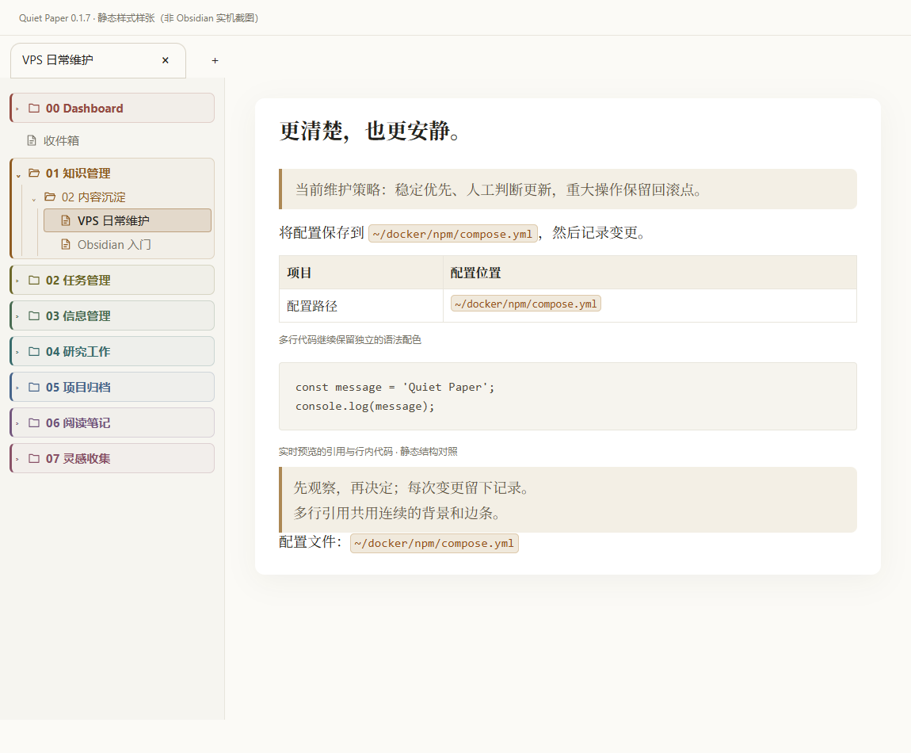
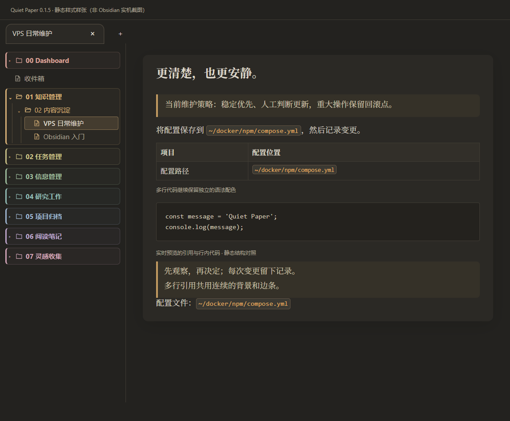

# Quiet Paper · 静纸

**English** | [简体中文](README.zh-CN.md)

A paper-inspired Obsidian theme with serif typography, warm light and dark palettes, and a colorful file explorer. Designed for comfortable Chinese and Latin text, with shared typography and spacing across Reading View and Live Preview.

**Version 0.1.8 · Obsidian ≥ 1.13.7 · Windows first · No required plugins**

## Preview

| Light | Dark |
| --- | --- |
|  |  |

Rendering depends on your fonts, zoom, and Obsidian version. See [validation notes](docs/VALIDATION.md) for the distinction between static browser checks and testing inside Obsidian.

## Features

- **Paper layout:** a centered reading area, soft shadows, and responsive margins.
- **Serif body text:** four embedded TeX Gyre Pagella faces for Latin text, paired with locally installed CJK serif fonts.
- **Consistent views:** Reading View and Live Preview share font, measure, and spacing settings.
- **Clear content boundaries:** warm blockquotes, amber inline code, and softly tinted callouts.
- **Visible hierarchy:** six heading levels, solid/hollow/square list bullets, and warm table headers without zebra stripes.
- **Natural mixed text:** start alignment by default; justification is optional. Text size, interface fonts, and code fonts follow Obsidian settings.
- **Colorful navigation:** eight muted folder colors, indentation guides, decorative file icons, and active-file highlights.
- **Rounded document tabs:** keep Obsidian's native controls and interaction patterns.
- **Print sizing:** Mermaid SVG diagrams scale proportionally to the printable area without changing their screen size.
- **Offline fonts:** no remote font or image requests at runtime.

## Installation

For manual installation, download the theme ZIP from [Releases](https://github.com/Tom2021-vice/obsidian-theme-quiet-paper/releases), or download the raw [theme.css](theme.css) and [manifest.json](manifest.json) files.

1. Create `.obsidian/themes/Quiet Paper/` inside your vault.
2. Place `theme.css` and `manifest.json` in that folder.
3. In Obsidian, open **Settings → Appearance → Themes** and select **Quiet Paper**.
4. Choose light or dark mode. An 18 px text size and **Readable line length** are suggested starting points, not enforced settings.

```text
Your vault/
└─ .obsidian/themes/Quiet Paper/
   ├─ manifest.json
   └─ theme.css
```

To update, replace both files. If needed, switch to the default theme and back. The demo ZIP is a separate test vault; do not copy its `.obsidian` settings over your personal vault.

Publishing a GitHub release does not itself add a theme to the Obsidian community directory.

## Fonts

| Purpose | Default | Embedded |
| --- | --- | --- |
| Latin body text | TeX Gyre Pagella: regular, italic, bold, bold italic | Yes |
| Chinese body text | Noto Serif SC / Source Han Serif SC, then system serif fallbacks | No |
| Interface | Your Obsidian setting or its native default | No |
| Code | Your Obsidian monospace setting or its native default | No |
| Mathematics | Obsidian's native MathJax fonts | No |

For Chinese text, install [Noto Serif SC](https://fonts.google.com/noto/specimen/Noto+Serif+SC) or [Source Han Serif](https://github.com/adobe-fonts/source-han-serif). Clear the custom **Text font** setting to use the theme's font pairing. Interface and monospace settings remain yours to choose. Paragraph spacing scales with your text size.

H4/H5/H6 request weights of 650/600/600; H6 also uses muted text. Actual weight depends on the font: the bundled Pagella faces provide 400 and 700, so intermediate values map to available weights.

## Customization

The theme works without plugins. With [Style Settings](https://github.com/mgmeyers/obsidian-style-settings), look for **Quiet Paper · 静纸**. The existing Chinese setting labels are listed below so they are easy to find.

| Setting | Default / effect |
| --- | --- |
| Text width / 正文宽度 | `40em` |
| Line height / 正文行高 | `1.6` |
| Paper padding / 纸面内边距 | `1.9em` |
| Chinese font / 中文字体 | Prefer local Noto Serif SC / Source Han Serif SC |
| Full-height empty lines / 保留完整空行高度 | Off; enable to disable empty-line tightening in Live Preview |
| Plain file explorer / 简洁文件目录 | Off; enable to remove colored groups and decorative icons |
| Flat paper / 平整纸面 | Remove rounded paper corners and shadows |
| Justify body text / 两端对齐正文 | Off; printing always uses start alignment |

Since 0.1.6, start alignment is the default and replaces the former left-alignment toggle. Leave justification off for long paths and mixed-language technical notes.

You can also use a CSS snippet:

```css
body {
  --qp-line-width: 40em;
  --qp-line-height: 1.6;
  --qp-paper-padding: 1.9em;
  --qp-cjk-font: "Noto Serif SC", "Source Han Serif SC", "SimSun";
}
```

## Compatibility and limitations

- Windows has received real usage feedback. Other platforms, mobile devices, and printing are not fully validated.
- Entering an empty line in Live Preview restores its normal height and may shift surrounding content. Enable the full-height empty-line option to opt out.
- Folder colors follow the currently mounted top-level folder order; sorting and virtual scrolling can change the sequence.
- A blank line before a table is part of Markdown parsing. The theme changes presentation, not note contents or syntax rules.
- Mermaid print sizing requires an SVG with a valid `viewBox`. Very long diagrams have smaller labels after scaling; landscape paper or splitting a diagram can help. CSS does not rearrange nodes.
- Blockquote padding includes an optical correction for the reading font. Set `--qp-quote-optical-offset: 0em` in a snippet for geometrically equal padding when using a different font.
- Optional justification uses browser layout, not Knuth–Plass paragraph breaking. MathJax remains responsible for formulas.
- Style Settings and third-party icon plugin combinations need further real-app testing.

See [validation notes](docs/VALIDATION.md) and the [Community Directory warning review](docs/COMMUNITY-REVIEW.md). Some warnings are intentionally retained to preserve fonts, editor spacing, link styling, and printable diagrams. A local check is not community-directory approval.

## Development

Requires Node.js 22+ and, for packaging, Python 3.10+. Browser checks use Microsoft Edge by default.

```sh
npm ci
npm run check
npm run check:community
npm test
python scripts/package.py
```

Edit `src/*.css`, then build the generated root `theme.css`. The build embeds all four font faces and removes formatting whitespace and ordinary comments without rewriting CSS rules. It preserves the Style Settings block and license header. Sources remain readable.

Builds update `dist/Quiet Paper/` and the theme copy in the project demo vault. They do not write to your personal vault or start Obsidian. Set `QP_BROWSER_EXECUTABLE` to use another Chromium browser; tests launch an isolated headless session. Initial dependency installation needs network access; normal builds and tests use local assets.

```text
src/             Theme CSS modules
assets/fonts/    Embedded fonts, provenance, and licenses
demo-vault/      Original typography and editing examples
scripts/         Build, audit, font preparation, and packaging tools
tests/           Isolated browser CSS and build regression checks
docs/            Validation, warning review, roadmap, and previews
.github/         CI, issue templates, and PR template
theme.css        Generated installable theme
manifest.json    Obsidian theme metadata
versions.json    Theme versions and minimum Obsidian versions
```

Keep both READMEs in sync. See [contributing guidelines](CONTRIBUTING.md), [changes](CHANGELOG.md), [roadmap](docs/ROADMAP.md), and [release instructions](docs/RELEASING.md). Report problems through [GitHub Issues](https://github.com/Tom2021-vice/obsidian-theme-quiet-paper/issues).

## Credits and licenses

Inspired by the document typography of [Telari](https://telari.app/). Quiet Paper is an independent theme, is not affiliated with Telari, and does not include its application code or transcribed sample copy.

Theme code, documentation, and original demo content use the [MIT License](LICENSE). Embedded fonts use the **GUST Font License**, not MIT. See [attribution](ATTRIBUTION.md) for font sources, conversion details, and license locations.
