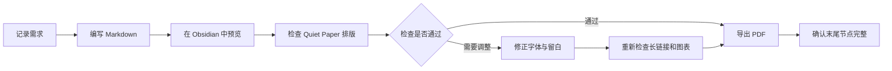
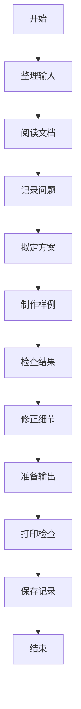

# 狭窄的空间，也要读得清楚

## 短段落

一页笔记可以很短。空白不需要被填满。

## 中西文与标点

这里没有手动加入中西间距：使用Obsidian记录Euler在1735年的发现，讨论Markdown与LaTeX，比较Windows和macOS里的字体。这一段用于观察当前渲染器是否支持自动间距，主题不会改写源文档。

“标点不该无故落在行首。”（括号里的说明）和《书名》、省略号……以及破折号——都需要在窄列里继续观察。另有α、β、π、2026、100%与英文word，检查字体回退和换行。

## 超长链接

https://example.com/a/very/long/path/that/should/not/widen/the/whole/document/abcdefghijklmnopqrstuvwxyz0123456789abcdefghijklmnopqrstuvwxyz0123456789

## 超宽代码

```text
This intentionally long line checks that code can scroll locally without stretching the entire note: 0123456789ABCDEFGHIJKLMNOPQRSTUVWXYZ0123456789ABCDEFGHIJKLMNOPQRSTUVWXYZ0123456789ABCDEFGHIJKLMNOPQRSTUVWXYZ
```

## 超宽公式

$$
\operatorname{Attention}(Q,K,V)=\operatorname{softmax}\left(\frac{QK^{\mathsf T}}{\sqrt{d_k}}\right)V+\underbrace{A+B+C+D+E+F+G+H+I+J+K+L+M+N+O+P}_{\text{a deliberately wide expression}}
$$

## 超宽表格

| 第一列 | 第二列 | 第三列 | 第四列 | 第五列 | 第六列 |
| --- | --- | --- | --- | --- | --- |
| abcdefghijklmnopqrstuv | abcdefghijklmnopqrstuv | abcdefghijklmnopqrstuv | abcdefghijklmnopqrstuv | abcdefghijklmnopqrstuv | abcdefghijklmnopqrstuv |

## 路径与文字混排表格

| 服务名称 | 功能 | 配置位置 | 数据目录 |
| --- | --- | --- | --- |
| Example Proxy | HTTPS 反向代理、证书管理 | `~/services/example-proxy/compose.yml` | `~/services/example-proxy/data`、`~/services/example-proxy/certificates` |
| Example Database | 数据库与定期备份 | `~/services/example-database/docker-compose.yml` | `~/services/example-database/postgresql/data` |
| Example Monitor | 状态监控与通知 | `~/services/example-monitor/compose.yml` | `~/services/example-monitor/data` |

文字列不应被长路径压缩成一两个汉字的宽度。点击路径单元格编辑时，也应保持普通单元格的内边距。

## 保留换行

第一行有两个空格。  
第二行是显式硬换行。

这一段的源码跨行，
在演示库开启严格换行后，它应作为一个段落显示。

## 字体样本

Hamburgefontsiv — AVATAR — 0123456789 — fi fl ffi ffl.

天地玄黄，宇宙洪荒。春江潮水连海平，海上明月共潮生。

日本語の組版では、句読点と余白の関係が大切です。

글자와 글자 사이의 작은 여백이 읽기의 흐름을 만듭니다.

## Mermaid 打印边界

下面的长横向图用于检查打印时右侧的终点是否完整。打印应等比缩放，而不是截掉节点；文字较小时，可选择横向纸张。



下面的纵向图用于检查高度约束；图表应整体放入页内，不将底部节点裁掉。


